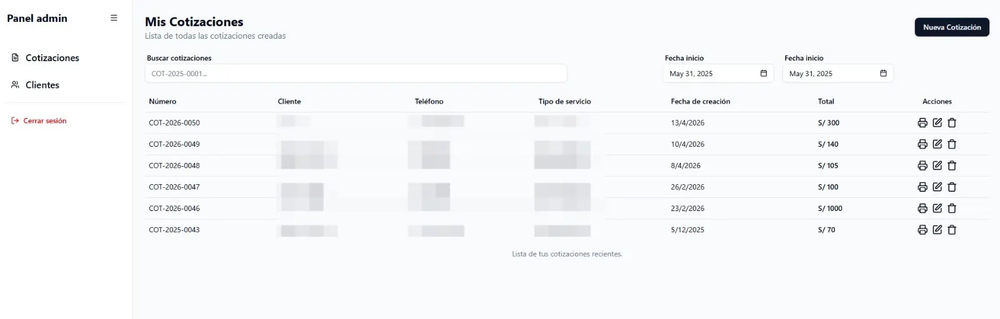
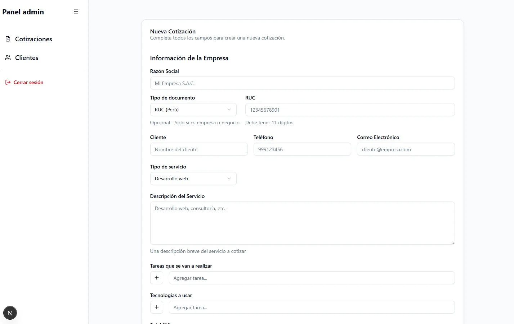
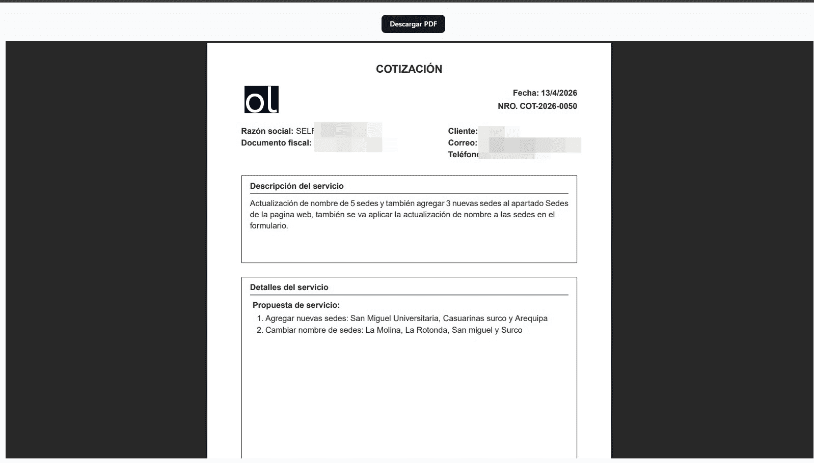

# 💼 Cotizador Freelance - Sistema de Cotizaciones Personalizadas

> Aplicación web para crear, gestionar y generar cotizaciones profesionales en PDF para servicios de desarrollo web freelance.

[]()
[]()

## 🎯 Características

- ✅ Crear cotizaciones personalizadas
- ✅ Editar cotizaciones existentes
- ✅ Eliminar cotizaciones
- ✅ Generar PDF profesional descargable
- ✅ Almacenamiento persistente en Supabase
- ✅ Interfaz intuitiva y responsive

## 🛠️ Tecnologías Utilizadas

- **Frontend:** React
- **Backend/BaaS:** Supabase
- **Generación de PDFs:** React-PDF
- **Base de Datos:** PostgreSQL (Supabase)
- **Autenticación:** Supabase Auth

## 📸 Capturas de Pantalla

### Dashboard Principal
<p align="center">
  
</p>
*Vista general del listado de cotizaciones*

### Crear Nueva Cotización
<p align="center">
  
</p>
*Formulario para crear cotizaciones personalizadas*

### Vista pdf Cotización
<p align="center">
  
</p>
*Vista pdf de la cotizacion creada*


## 💡 Motivación del Proyecto

Como desarrollador freelance, necesitaba una herramienta eficiente para gestionar cotizaciones de proyectos web. Este sistema me permite:
- Crear presupuestos profesionales en minutos
- Mantener un histórico de todas mis cotizaciones
- Generar documentos PDF de calidad para enviar a clientes
- Agilizar mi proceso de ventas y gestión de proyectos

## 🚀 Funcionalidades Destacadas

### 1. **Gestión Completa de Cotizaciones**
   - Crear cotizaciones con información detallada del proyecto
   - Editar cotizaciones existentes
   - Eliminar cotizaciones obsoletas
   - Búsqueda y filtrado

### 2. **Generación de PDF Profesional**
   - Diseño profesional y personalizable
   - Descarga instantánea
   - Formato listo para enviar a clientes
   - Incluye detalles del servicio, precios y condiciones

### 3. **Categorización de Servicios**
   - Desarrollo Web
   - Soporte Web
   - Asesoría Técnica
   - Desarrollo HTML/CSS

### 4. **Almacenamiento en la Nube**
   - Sincronización automática con Supabase
   - Acceso desde cualquier dispositivo
   - Backup automático de datos

## 📊 Arquitectura del Sistema

```
┌─────────────────┐      ┌──────────────┐      ┌─────────────┐
│   React App     │ ───► │   Supabase   │ ───► │ PostgreSQL  │
│  (Frontend)     │      │     API      │      │  Database   │
└────────┬────────┘      └──────────────┘      └─────────────┘
         │
         │
         ▼
┌─────────────────┐
│   React-PDF     │
│ (PDF Generator) │
└─────────────────┘
```

## 🔐 Seguridad y Autenticación

- Autenticación segura mediante Supabase Auth
- Row Level Security (RLS) para protección de datos
- Solo el usuario propietario puede ver y editar sus cotizaciones
- Validación de datos en cliente y servidor

## 📝 Estructura de una Cotización

Cada cotización incluye:
- **Información del Cliente:** Nombre, empresa, contacto
- **Detalles del Proyecto:** Descripción, alcance
- **Servicios:** Lista itemizada de servicios
- **Precios:** Desglose de costos
- **Condiciones:** Términos de pago y entrega
- **Validez:** Fecha de expiración de la cotización

## 💻 Casos de Uso

1. **Desarrollo Web Completo**
   - Frontend + Backend
   - Diseño responsive
   - Integración de APIs

2. **Soporte y Mantenimiento**
   - Actualizaciones mensuales
   - Corrección de errores
   - Optimización de performance

3. **Asesoría Técnica**
   - Consultoría de arquitectura
   - Code review
   - Optimización de procesos

4. **Desarrollo HTML/CSS**
   - Landing pages
   - Email templates
   - Componentes UI

## 📝 Aprendizajes del Proyecto

Durante el desarrollo aprendí:
- Implementación de **React-PDF** para generación dinámica de documentos
- Manejo de **CRUD completo** con Supabase
- Diseño de **formularios complejos** con validación
- Optimización de **queries en tiempo real**
- Arquitectura de **componentes reutilizables**
- Gestión de **estado global** en aplicaciones React

## 🔮 Próximas Mejoras

- [ ] Manejo de estado de cotizaciones (Pendiente, Aprobada, Rechazada)
- [ ] Adjunto de pagos y seguimiento de facturación
- [ ] Módulo de gestión de clientes
- [ ] Plantillas personalizables de PDF
- [ ] Notificaciones por email
- [ ] Dashboard con estadísticas de cotizaciones
- [ ] Exportar a múltiples formatos (Excel, CSV)
- [ ] Sistema de recordatorios para seguimiento


## 🚦 Estado del Proyecto

Este proyecto está **completado y en uso activo** para mi trabajo freelance. Las nuevas funcionalidades se agregan según las necesidades del negocio.

## 👨‍💻 Autor

**Orbet Lozada**
- GitHub: [@orbetjose](https://github.com/orbetjose)
- LinkedIn: [Orbet Lozada](https://www.linkedin.com/in/orbet-lozada/)
- Portafolio: [orbetjose.dev](https://orbetjose.dev)

## 📄 Licencia

Este proyecto es de uso personal. Si deseas utilizarlo como base para tu propio cotizador, siéntete libre de hacerlo dando el crédito correspondiente.

---

<p align="center">
  ⭐ Si este proyecto te resultó útil o interesante, considera darle una estrella en GitHub
</p>

<p align="center">
  💼 <b>Disponible para proyectos freelance de desarrollo web</b>
</p>